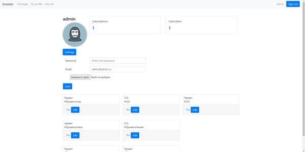
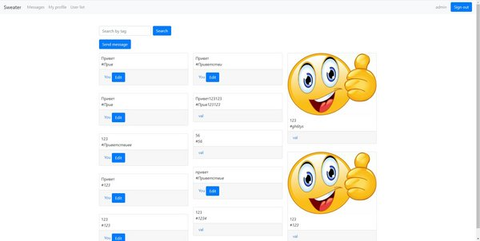
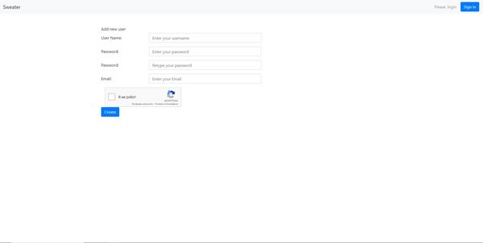

# Sweater

## Описание
Sweater - это веб-приложение - аналог твитера, разработанный в рамках учебного процесса с целью изучения возможностей фреймворка Spring. Проект представляет собой веб-приложение для публикации коротких сообщений и обмена мыслями с другим пользователям.<br><br>
**_Быстро делитесь своими идеями и впечатлениями, оставляй креативные "свиты"._** 🧶💬🌐


## Пример работы приложения

Здесь представлены некоторые скриншоты приложения:

<
<br>Страница пользователя с мозможность редактировать профиль, отслеживать подписки и подписчиков, вносить изменения в тредыдущие сообщения<br>
<br>
<br>

<br>Главная страница сайта, где отображаются сообщения пользователей. Имеется возможность поиска сообщений по тегу<br>
<br>
<br>

<br>Страница регистрации нового пользователя с каптчей<br>

## Зависимости

Проект использует следующие зависимости:

- [Spring Boot Starter Web](https://docs.spring.io/spring-boot/docs/current/reference/html/web.html)
- [Spring Data JPA](https://spring.io/projects/spring-data-jpa)
- [Spring Security](https://spring.io/projects/spring-security)
- [Spring Boot Starter Mail](https://www.baeldung.com/spring-email)
- [Spring Boot Starter Validation](https://www.baeldung.com/spring-boot-bean-validation)
- [Spring Session JDBC](https://www.baeldung.com/spring-session-jdbc)
- [FreeMarker](https://freemarker.apache.org/docs/index.html)
- [Bootstrap](https://getbootstrap.com/docs/5.3/getting-started/introduction/)
- [PostgreSQL](https://jdbc.postgresql.org/)
- [Flyway Core](https://flywaydb.org/)

## Особенности запуска

Если вы хотите запустить этот проект у себя, то Вам потребуется:
- Скачать и установить себе [PostgreSQL](https://jdbc.postgresql.org/download/), после чего создать базу данных "sweater" (советую настроаивать через PdAdmin)  можно использовать этот [гайд](https://docs.rkeeper.ru/rk7/latest/ru/ustanovka-postgresql-na-windows-29421153.html). 
- Создать почту с которой вы будете расслылать код подтверждения для регистрации и настроить на ней доступ из "внешних приложений". Для примера ссылка для настройки почты от [Mail.ru](https://help.mail.ru/id/settings/2fa/apps)
- Добавить в Application.propeties свои данные для работы 
```
spring.datasource.username= "Имя подльзователя которое вы задали при установке БД"
spring.datasource.password= "Пароль который вы задали при установке БД"
spring.mail.username=  "Email почты который создали ранее"
spring.mail.password= "Пароль от почты для стороннего приложения Важно!!! это не тот же пароль с помощь которого вы заходите на почту через браузер"
```
- А так же нужно изменить путь для загрузки изображение с учетом того куда сохранен ваш проект на компьютере
```
upload.path=/D:/Project/Sweater/upload
```
## Статус проекта

Проект завершен.

## Источники
[Канал letsCode на YouTube](https://www.youtube.com/@letsCodeDru)

## Контакты

Если у вас есть вопросы или вы хотите сообщить об ошибке, свяжитесь со мной по электронной почте: Wrk-podlipaev@mail.ru или напишите в мой telegram [@Valyez](https://t.me/@Valyez) 
